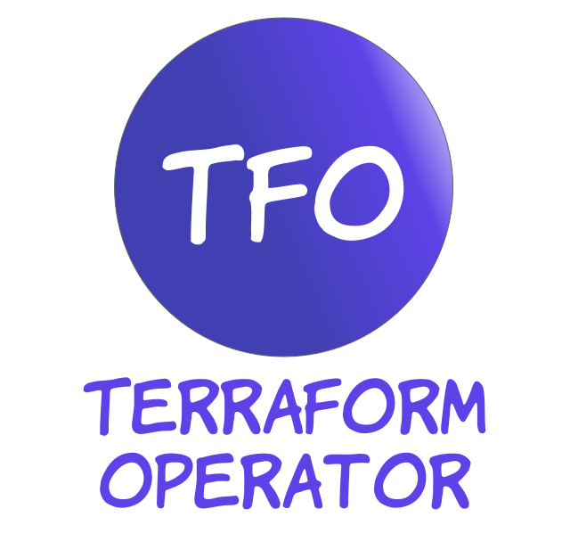

# Terraform Operator
<p align="center"></p>

<p align="center">
  <a href="https://github.com/kube-champ/terraform-operator/actions/workflows/build.yaml">
    
  </a>
  
  <a href="https://codecov.io/gh/kube-champ/terraform-operator">
    
  </a>

   <a href="https://goreportcard.com/report/github.com/kube-champ/terraform-operator">
    
  </a>

   <a href="https://opensource.org/licenses/Apache-2.0">
    
  </a>
</p>

The Terraform Operator provides support to run Terraform modules in Kubernetes in a declaritive way as a [Kubernetes manifest](https://kubernetes.io/docs/concepts/cluster-administration/manage-deployment/).

This project makes running a Terraform module, Kubernetes native through a single Kubernetes [CRD](https://kubernetes.io/docs/tasks/extend-kubernetes/custom-resources/custom-resource-definitions/). You can run the manifest with kubectl, Terraform, GitOps tools, etc...

**Disclaimer**

This project is not a YAML to HCL converter. It just provides a way to run Terraform commands through a Kubernetes CRD. To see how this controller works, have a look at the [design doc](https://kube-champ.github.io/terraform-operator/design/)

## Installation

**Helm**

```bash
  helm repo add kube-champ https://kube-champ.github.io/helm-charts
  helm install terraform-operator kube-champ/terraform-operator
```

Chart can be found [here](https://github.com/kube-champ/helm-charts/tree/master/charts/terraform-operator)

**Kubectl**

```bash
  kubectl apply -k https://github.com/kube-champ/terraform-operator/config/crd 
  kubectl apply -k https://github.com/kube-champ/terraform-operator/config/manifest
```

## Docuemntation
For docuemntation, check our page [here](https://kube-champ.github.io/terraform-operator/)

## Usage
For more examples on how to use this CRD, check the [samples](https://kube-champ.github.io/terraform-operator/examples/)

```yaml
apiVersion: run.terraform-operator.io/v1alpha1
kind: Terraform
metadata:
  name: first-module
spec:
  terraformVersion: 1.0.2

  module:
    source: IbraheemAlSaady/test/module
    ## optional module version
    version:

   ## a terraform workspace to select
  workspace:

  ## a custom terraform backend
  backend: |
    backend "local" {
      path = "/tmp/tfmodule/mytfstate.tfstate"
    }

  ## a custom providers config
  providersConfig:

  ## a list of terraform variables to be provided
  variables:
    - key: length
      value: "16"
    
    - key: AWS_ACCESS_KEY
      valueFrom:
        ## can be configMapKeyRef as well
        secretKeyRef:
          name: aws-credentials
          key: AWS_ACCESS_KEY
      environmentVariable: true

  ## files with ext '.tfvars' or '.tf' that will be mounted into the terraform runner job 
  ## to be passed to terraform as '-var-file'
  variableFiles:
    - key: terraform-env-config
      valueFrom:
        ## can also be 'secret'
        configMap:
          name: "terraform-env-config"

  dependsOn:
    - name: run-base
      ## if its in another namespace
      namespace:
  
  ## ssh key from a secret to allow pull modules from private git repos
  gitSSHKey:
    valueFrom:
      ....

  ## outputs defined will be stored in a Kubernetes secret
  outputs:
      ## The Kubernetes Secret key
    - key: my_new_output_name
      ## the output name from the module
      moduleOutputName: result

  ## a flag to run a terraform destroy
  destroy: false

  ## a flag to delete the job after the job is completed
  deleteCompletedJobs: false

  ## number of retries in case of run failure
  retryLimit: 2
```

## Roadmap
Check the [Terraform Operator Project](https://github.com/orgs/kube-champ/projects/1) to see what's on the roadmap

## Contributing
If you find this project useful, help us:

- Support the development of this project and star this repo! :star:
- Help new users with issues they may encounter :muscle:
- Send a pull request with your new features and bug fixes :rocket: 

For instructions about setting up your environment to develop and extend the operator, please see [contributing.md](https://kube-champ.github.io/terraform-operator/contributing-guide/)
